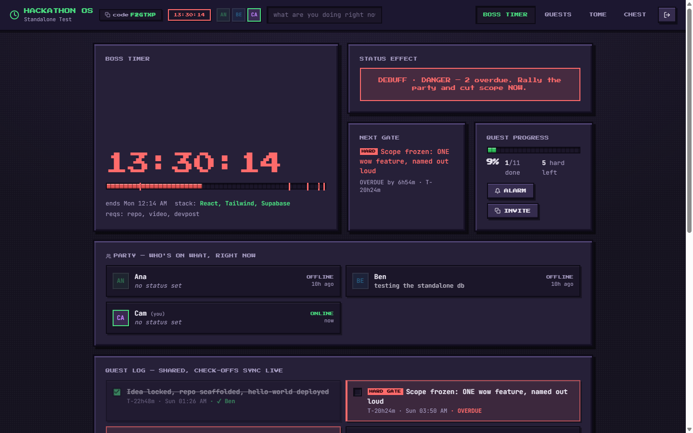
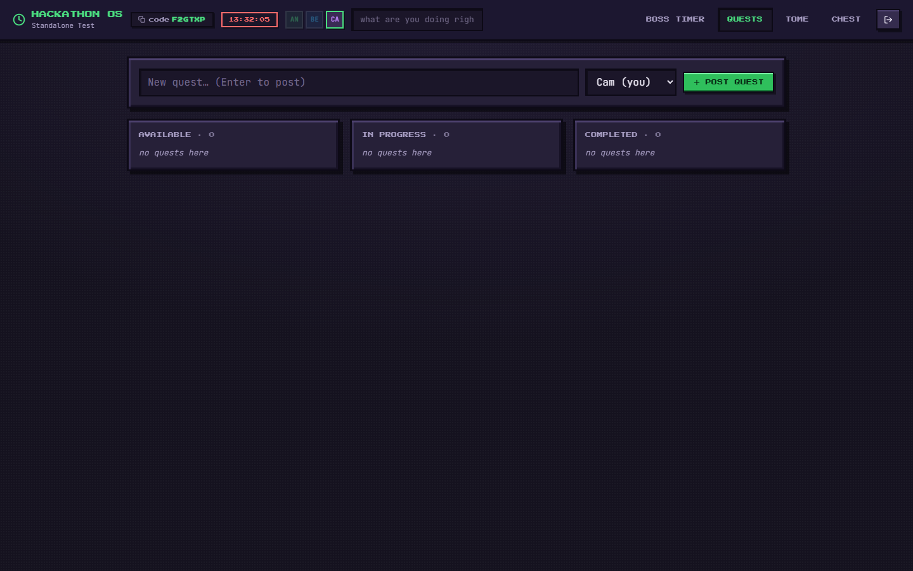
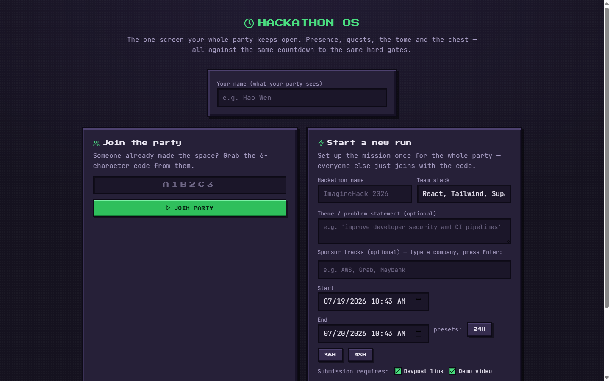

<div align="center">

# Hackathon OS

**The real-time control center for hackathon teams.**
One shared screen on a second monitor for your entire team throughout the event.

[](https://react.dev/)
[](https://tailwindcss.com/)
[](https://supabase.com/)
[](https://vitejs.dev/)

[Key Features](#key-features) • [Preview](#preview) • [Pixel Skin](#pixel-skin-v2-ui) • [Architecture](#architecture) • [Getting Started](#getting-started) • [Deployment](#self-hosting--database-setup)

---

</div>

## Overview

Traditional management tools like Notion, Trello, and Slack treat time as passive metadata (such as a due date on a card or a reminder in a chat thread). In a hackathon, time is a fixed window with unforgiving submission deadlines.

**Hackathon OS** makes the countdown the central interface surface. Teammate presence, active focus status, task boards, shared scratchpads, and hard-gate alarms render against a single synchronized clock across all devices.

---

## Preview

<div align="center">
  
</div>

<br />

<div align="center">
  <table width="100%">
    <tr>
      <td width="50%" align="center">
        <b>Quest Board (Tasks)</b><br/>
        
      </td>
      <td width="50%" align="center">
        <b>Team Space Join</b><br/>
        
      </td>
    </tr>
  </table>
</div>

---

## Key Features

> [!NOTE]
> Designed specifically to run on a second monitor for the entire duration of a hackathon.

### Team Workspace
Create a team space once and invite teammates via a 6-character room code. Configures a shared mission profile (name, theme, tracks, tech stack, and submission window) synchronized across all client sessions.

### Real-Time Presence
Displays live member avatars with online, idle, and offline indicators. Each member can set a custom status line (similar to a Figma cursor label) showing current focus in real time.

### Shared Deadline Guardian
A synchronized countdown timer backed by a deterministic milestone engine. Escalates alerts (browser notifications, audio chimes, tab title flashing, and screen pulsing) across all team devices as submission deadlines approach. Checking off a milestone updates everyone's display instantly with member attribution.

### Interactive Task Board
A lightweight Kanban board (To Do, Doing, Done) supporting task assignment, live state synchronization, and team-wide visibility.

### Collaborative Notes
A single shared scratchpad featuring last-write-wins synchronization and live active-editor indicators to prevent overwrite collisions before they occur.

### Asset Storage
Cloud file sharing optimized for hackathon deliverables (up to 10 MB per team), including pitch deck drafts, design assets, and backup demonstration media.

---

## Pixel Skin (v2 UI)

The user interface uses a 16-bit retro aesthetic designed for high visibility and reduced cognitive fatigue. Modules are presented as game elements:

- **Boss Timer**: Guardian module for milestone countdowns and deadline alerts.
- **Quest Board**: Task management interface.
- **Tome**: Collaborative scratchpad for team notes.
- **Chest**: Shared file repository.

### Technical Performance Highlights

- **Custom Pixel Bevels**: Created using layered zero-blur `box-shadow` definitions and hard offset drop shadows.
- **Zero GPU Overhead**: Removed heavy `backdrop-filter` rules and continuous background animations, replacing them with a static dither pattern and vignette painted once on load.
- **Dual-Font Typography**: Combines *Press Start 2P* for chrome elements (headings, buttons, countdown digits) with *JetBrains Mono* for readable body text.
- **Framerate Metrics**: Performance profiling at 1440x900 resolution demonstrated an average frame render time of 6.1 ms during active tab switches and milestone toggles (compared to 7.5 ms baseline in legacy builds).

---

## Architecture

Built as a static React 18 application powered by Tailwind CSS v4 and Vite, backed by Supabase for real-time data persistence.

```
frontend/src/
├── lib/core.js       Deterministic milestone engine, pace logic, and alarm timing.
│                     Pure JavaScript module with standalone test suite. Identical milestones
│                     are computed locally on each client, minimizing database overhead.
├── lib/supabase.js   Supabase client configuration and initialization.
├── lib/team.js       Centralized custom hook managing session state and real-time channels.
├── lib/ui.jsx        SVG icons, alarm sound synthesis, and toast notification utilities.
├── App.jsx           Root shell: navigation bar, countdown header, avatars, and tab router.
└── modules/          Join, Guardian, Tasks, Notes, and Files component views.
supabase/migrations/  SQL schema files for self-hosting on any PostgreSQL / Supabase project.
```

### Sync Mechanisms

All database tables are namespaced with the `hackos_` prefix.

| Feature Surface | Synchronization Strategy |
|---|---|
| Milestones, Tasks, Notes, Statuses | Supabase `postgres_changes` subscriptions filtered by team ID |
| Online / Offline Presence | Supabase Realtime Presence channel (join and leave events) |
| File Lists & Gate Removals | Supabase Realtime Broadcast events on the team channel |

---

## Getting Started

### Prerequisites

- Node.js version 18 or higher
- npm package manager

### Local Development Setup

1. Clone the repository and navigate to the frontend directory:
   ```bash
   cd frontend
   npm install
   ```

2. Configure environment variables in `frontend/.env`:
   ```env
   VITE_SUPABASE_URL=https://YOUR-PROJECT-REF.supabase.co
   VITE_SUPABASE_ANON_KEY=sb_publishable_...
   ```

3. Launch the local development server:
   ```bash
   npm run dev
   ```
   Open `http://localhost:5173` in your browser.

4. Execute core engine tests:
   ```bash
   npm test
   ```
   Expected output: `PASS`

---

## Self-Hosting & Database Setup

To deploy your own backend instance:

1. Create a project in [Supabase](https://supabase.com/).
2. Open the SQL Editor in the Supabase Dashboard and run the script located at [supabase/migrations/001_hackos_team_space.sql](supabase/migrations/001_hackos_team_space.sql).
3. Copy your project URL and public anon key into `frontend/.env`.

---

## Security Model

Row Level Security (RLS) is enabled across all `hackos_*` tables. Data access is governed by the shared 6-character team code. For enterprise or public multi-tenant environments, the schema can be extended with Supabase Auth policies as indicated in the migration script.

---

## Architecture Refactoring History

The codebase was refactored from a single-player AI tool into a dedicated multiplayer team dashboard. Key changes include:

- **AI Layer Removal**: Removed `lib/agents.js` (Scout, Strategist, Pitchsmith modules) and Anthropic API dependencies.
- **Simplified Navigation**: Removed settings and standalone AI prompt tabs.
- **Embedded References**: Converted judging rubric weights and recording checklists into static reference modules inside the Guardian view.


