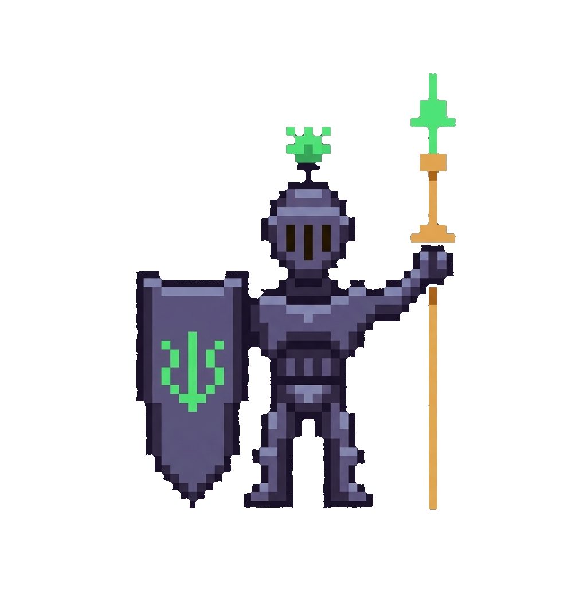

<div align="center">



# Hackathon OS

**The real-time control center for hackathon teams.**  
*One shared screen on a second monitor for your entire team throughout the event.*

[](https://react.dev/)
[](https://tailwindcss.com/)
[](https://supabase.com/)
[](https://vitejs.dev/)
[](LICENSE)

[Overview](#overview) • [Preview](#preview) • [Key Features](#key-features) • [Pixel Skin v2 UI](#pixel-skin-v2-ui) • [Architecture](#architecture) • [Getting Started](#getting-started) • [Self-Hosting](#self-hosting--database-setup) • [License](#license)

---

</div>

## Overview

Traditional project management tools like Notion, Trello, and Slack treat time as passive metadata (such as a static due date on a card or a scheduled reminder in a chat channel). In a high-stakes hackathon, time is a fixed, unforgiving window with a hard submission deadline.

**Hackathon OS** flips this paradigm by placing the countdown clock at the core of the user experience. Teammate presence, live status lines, task boards, collaborative scratchpads, and escalating alarms render against a single synchronized clock across all team member devices.

> [!TIP]
> Designed specifically to be left open on a **second monitor** or **shared dashboard screen** throughout the entire hackathon.

---

## Preview

<div align="center">
  
</div>

<br />

<div align="center">
  <table width="100%">
    <tr>
      <td width="50%" align="center">
        <b>Quest Board (Tasks)</b><br/>
        
      </td>
      <td width="50%" align="center">
        <b>Team Space Join</b><br/>
        
      </td>
    </tr>
  </table>
</div>

---

## Key Features

### Boss Timer (Shared Deadline Guardian)
A synchronized countdown timer powered by a deterministic milestone engine.
- Escalates multi-sensory alerts (browser push notifications, synthesized audio chimes, tab title flashing, and ambient screen pulsing) as deadlines approach.
- Instant team-wide updates with member attribution whenever a milestone is checked off.

### Party Presence
- Live member avatars showing online, idle, and offline states via Supabase Realtime Presence.
- Dynamic status line (similar to a Figma cursor label) allowing members to broadcast their current focus area in real time.

### Quest Board (Interactive Tasks)
- Lightweight Kanban board (To Do, Doing, Done) with member assignment.
- Sub-second state synchronization across all connected clients.

### Tome (Collaborative Notes)
- Shared scratchpad featuring last-write-wins synchronization.
- Live active-editor indicators to prevent concurrent typing collisions.

### Chest (Asset Storage)
- Shared cloud storage optimized for hackathon deliverables (up to 10 MB per team space).
- Quick distribution of pitch deck drafts, design assets, and demo media.

---

## Pixel Skin (v2 UI)

The user interface features a retro 16-bit aesthetic crafted specifically for high visibility, zero cognitive fatigue, and immersion. Core components are styled as classic RPG elements:

- **Boss Timer**: Guardian module for milestone countdowns and deadline alarms.
- **Quest Board**: Interactive task management board.
- **Tome**: Collaborative scratchpad notebook.
- **Chest**: Shared team file repository.

### Technical Performance Highlights

- **Custom Pixel Bevels**: Layered zero-blur `box-shadow` definitions and hard offset drop shadows create retro tactile depth without CSS framework overhead.
- **Zero GPU Strain**: Replaced heavy `backdrop-filter` blurs and continuous loop animations with a static dither pattern and vignette painted once on render.
- **Dual-Font Typography**: Combines *Press Start 2P* for retro chrome elements (headings, buttons, countdown digits) with *JetBrains Mono* for crisp, high-legibility body text.
- **Framerate Benchmarks**: Average frame render time of **6.1 ms** at 1440x900 resolution during active tab switches and milestone updates (down from 7.5 ms baseline in legacy builds).

---

## Architecture

Built as a static React 18 single-page application using Tailwind CSS v4 and Vite, backed by Supabase for real-time multiplayer data synchronization.

```
HackathonOS/
├── frontend/
│   ├── src/
│   │   ├── lib/
│   │   │   ├── core.js       # Deterministic milestone engine & pace calculations (standalone unit tests)
│   │   │   ├── supabase.js   # Supabase client configuration & initialization
│   │   │   ├── team.js       # Central custom React hook managing team session & real-time channels
│   │   │   └── ui.jsx        # SVG icon library, audio alarm synthesizer & toast utilities
│   │   ├── modules/
│   │   │   ├── Join.jsx      # Team space creation & 6-character room code entry
│   │   │   ├── Guardian.jsx  # Boss Timer countdown, milestones & static judging rubrics
│   │   │   ├── Tasks.jsx     # Quest Board Kanban view
│   │   │   ├── Notes.jsx     # Tome collaborative scratchpad
│   │   │   └── Files.jsx     # Chest file storage & upload manager
│   │   ├── App.jsx           # Application shell: navigation bar, countdown header, avatars & router
│   │   ├── index.css         # Pixel design system, retro color tokens & keyframes
│   │   └── main.jsx          # React DOM entry point
│   └── package.json
└── supabase/
    └── migrations/
        ├── 001_hackos_team_space.sql    # Core database schema, tables & RLS policies
        └── 002_editable_milestones.sql   # Extended schema for editable team milestones
```

### Synchronization Matrix

All database tables are namespaced with the `hackos_` prefix.

| Feature Surface | Realtime Mechanism | Description |
|---|---|---|
| Milestones, Tasks, Notes, Statuses | Supabase `postgres_changes` | Filtered subscriptions by team ID for instant row updates |
| Online / Offline Presence | Supabase Realtime Presence | Live member tracking, join/leave events & status lines |
| File Lists & Notifications | Supabase Realtime Broadcast | Low-latency client event broadcasts across the team channel |

---

## Getting Started

### Prerequisites

- **Node.js** version 18.0 or higher
- **npm** package manager

### Local Development Setup

1. **Clone the repository and install dependencies:**
   ```bash
   cd frontend
   npm install
   ```

2. **Configure environment variables:**
   Create a `.env` file inside the `frontend/` folder:
   ```env
   VITE_SUPABASE_URL=https://YOUR-PROJECT-REF.supabase.co
   VITE_SUPABASE_ANON_KEY=your_supabase_anon_key
   ```

3. **Launch the local development server:**
   ```bash
   npm run dev
   ```
   Open `http://localhost:5173` in your browser.

4. **Run core engine tests:**
   ```bash
   npm test
   ```
   Expected output:
   ```text
   PASS: core selftest (milestone engine + pace + formatters)
   ```

---

## Self-Hosting & Database Setup

To host your own backend instance on Supabase:

1. Create a new project in [Supabase](https://supabase.com/).
2. Open the **SQL Editor** in your Supabase Dashboard.
3. Run the migration scripts in sequential order:
   - [001_hackos_team_space.sql](supabase/migrations/001_hackos_team_space.sql) (Base schema & security rules)
   - [002_editable_milestones.sql](supabase/migrations/002_editable_milestones.sql) (Milestone engine schema extensions)
4. Enable **Supabase Realtime** for `hackos_*` tables under Database → Realtime settings.
5. Create a Storage Bucket named `hackos_files` with public or authenticated access depending on your needs.
6. Copy your project URL and public anon key into `frontend/.env`.

> **Wake the backend before the event.** Supabase free-tier projects pause automatically after about a week of inactivity, and a paused project stops resolving its hostname entirely. The app then fails at the first request: no team create, no join, no presence, no gates. Open the Supabase dashboard (or hit any table) a day before the hackathon and confirm the project reads `ACTIVE_HEALTHY`. Restoring takes a few minutes, which is time you will not have on demo day.

---

## Security Model

Row Level Security (RLS) is enabled across all `hackos_*` tables. Data access is scoped to team members possessing the 6-character room code. For enterprise multi-tenant deployments, the schema can be extended with Supabase Auth user policies as detailed in the SQL migration comments.

---

## Architecture Refactoring History

The codebase was restructured from an AI single-player tool into a dedicated multiplayer team dashboard. Key refactoring milestones:

- **AI Layer Removal**: Removed legacy Anthropic API dependencies and agent scripts (`lib/agents.js`).
- **Simplified Navigation**: Consolidated navigation to focus purely on second-monitor team collaboration.
- **Embedded References**: Converted judging rubric weights and submission checklists into static reference modules within the Guardian view.

---

## License

This project is licensed under the **MIT License**. See the [LICENSE](LICENSE) file for details.
