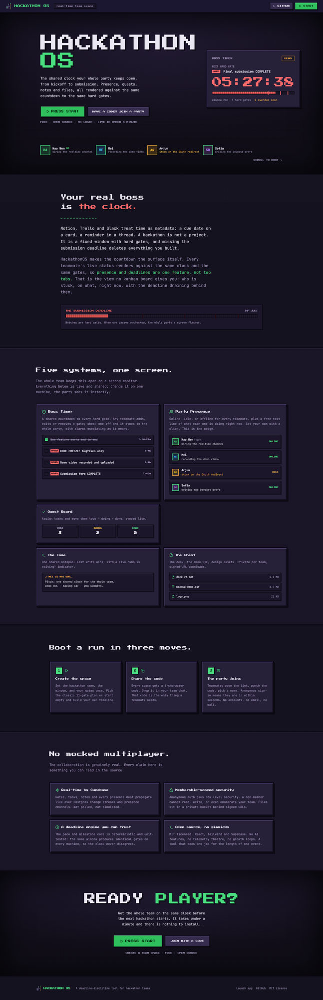

<div align="center">


# Hackathon OS

**The real-time control center for hackathon teams.**  
*One shared screen on a second monitor for your entire team throughout the event.*

[](https://react.dev/)
[](https://tailwindcss.com/)
[](https://supabase.com/)
[](https://vitejs.dev/)
[](LICENSE)

[Overview](#overview) • [Preview](#preview) • [Title Screen](#the-title-screen) • [Key Features](#key-features) • [Pixel Skin v2 UI](#pixel-skin-v2-ui) • [Architecture](#architecture) • [Getting Started](#getting-started) • [Self-Hosting](#self-hosting--database-setup) • [License](#license)

---

</div>

## Overview

Traditional project management tools like Notion, Trello, and Slack treat time as passive metadata (such as a static due date on a card or a scheduled reminder in a chat channel). In a high-stakes hackathon, time is a fixed, unforgiving window with a hard submission deadline.

**Hackathon OS** flips this paradigm by placing the countdown clock at the core of the user experience. Teammate presence, live status lines, task boards, collaborative scratchpads, and escalating alarms render against a single synchronized clock across all team member devices.

> [!TIP]
> Designed specifically to be left open on a **second monitor** or **shared dashboard screen** throughout the entire hackathon.

---

## Preview

<div align="center">
  <b>Title Screen</b> — the landing that boots into the app, with a live countdown as the hero<br/>
  
</div>

<br />

<div align="center">
  <b>Boss Timer</b> — the shared deadline guardian<br/>
  
</div>

<br />

<div align="center">
  <table width="100%">
    <tr>
      <td width="50%" align="center">
        <b>Quest Board (Tasks)</b><br/>
        
      </td>
      <td width="50%" align="center">
        <b>Team Space Join</b><br/>
        
      </td>
    </tr>
  </table>
</div>

---

## The Title Screen

First-time visitors land on an arcade **title screen** that boots straight into the app, extending the same 16-bit world instead of a generic marketing page. It is a route inside the app (rendered before the join screen), not a separate site.

- **Live countdown hero.** The centerpiece is a real, ticking Boss Timer (labelled `DEMO`), so the product proves itself instead of asserting a claim. `PRESS START` reveals the create/join flow.
- **The wedge, stated plainly.** A *"your real boss is the clock"* section frames the differentiator: a hackathon is a fixed window with hard gates, not a project, so presence and deadlines are one feature, not two tabs.
- **Five systems, shown live.** Boss Timer, Party Presence, Quest Board, Tome and Chest are previewed with real-looking state, then a three-step *"boot a run"* walkthrough and a source-backed *"no mocked multiplayer"* section (real-time by Supabase, membership-scoped security, a deterministic tested engine, MIT).
- **Honest by design.** The hero countdown and party lineup are illustrative demo data; every factual claim is true of the shipped product. No fabricated metrics, testimonials, or logos.
- **Same performance discipline.** Static CRT scanlines and dither, a pixel wordmark with stepped shadows, level-select tiles that physically press on hover; no `backdrop-filter`, at most two small looping elements, and `prefers-reduced-motion` disables all motion.

---

## Key Features

### Boss Timer (Shared Deadline Guardian)
A synchronized countdown timer powered by a deterministic milestone engine.
- Escalates multi-sensory alerts (browser push notifications, synthesized audio chimes, tab title flashing, and ambient screen pulsing) as deadlines approach.
- Instant team-wide updates with member attribution whenever a milestone is checked off.

### Party Presence
- Live member avatars showing online, idle, and offline states via Supabase Realtime Presence.
- Dynamic status line (similar to a Figma cursor label) allowing members to broadcast their current focus area in real time.

### Quest Board (Interactive Tasks)
- Lightweight Kanban board (To Do, Doing, Done) with member assignment.
- Sub-second state synchronization across all connected clients.

### Tome (Collaborative Notes)
- Shared scratchpad featuring last-write-wins synchronization.
- Live active-editor indicators to prevent concurrent typing collisions.

### Chest (Asset Storage)
- Shared cloud storage optimized for hackathon deliverables (up to 10 MB per team space).
- Quick distribution of pitch deck drafts, design assets, and demo media.

---

## Pixel Skin (v2 UI)

The user interface features a retro 16-bit aesthetic crafted specifically for high visibility, zero cognitive fatigue, and immersion. Core components are styled as classic RPG elements:

- **Title Screen**: Arcade-style landing that boots into the app, with a live demo countdown, CRT scanlines, and level-select tiles.
- **Boss Timer**: Guardian module for the editable milestone timeline, countdowns and deadline alarms.
- **Quest Board**: Interactive task management board.
- **Tome**: Collaborative scratchpad notebook.
- **Chest**: Shared team file repository.

### Technical Performance Highlights

- **Custom Pixel Bevels**: Layered zero-blur `box-shadow` definitions and hard offset drop shadows create retro tactile depth without CSS framework overhead.
- **Zero GPU Strain**: Replaced heavy `backdrop-filter` blurs and continuous loop animations with a static dither pattern and vignette painted once on render.
- **Dual-Font Typography**: Combines *Press Start 2P* for retro chrome elements (headings, buttons, countdown digits) with *JetBrains Mono* for crisp, high-legibility body text.
- **Framerate Benchmarks**: Average frame render time of **6.1 ms** at 1440x900 resolution during active tab switches and milestone updates (down from 7.5 ms baseline in legacy builds).

---

## Architecture

Built as a static React 18 single-page application using Tailwind CSS v4 and Vite, backed by Supabase for real-time multiplayer data synchronization.

```
HackathonOS/
├── frontend/
│   ├── src/
│   │   ├── lib/
│   │   │   ├── core.js       # Deterministic milestone engine & pace calculations (standalone unit tests)
│   │   │   ├── supabase.js   # Supabase client configuration & initialization
│   │   │   ├── team.js       # Central custom React hook managing team session & real-time channels
│   │   │   └── ui.jsx        # SVG icon library, audio alarm synthesizer & toast utilities
│   │   ├── modules/
│   │   │   ├── Landing.jsx   # Arcade title-screen landing (renders before Join for first-time visitors)
│   │   │   ├── Join.jsx      # Team space creation & 6-character room code entry
│   │   │   ├── Guardian.jsx  # Boss Timer: countdown + editable milestone timeline (add/edit/remove gates)
│   │   │   ├── Tasks.jsx     # Quest Board Kanban view + one-click submission-checklist seed
│   │   │   ├── Notes.jsx     # Tome collaborative scratchpad
│   │   │   └── Files.jsx     # Chest file storage & signed-URL downloads
│   │   ├── App.jsx           # Application shell: landing/join gate, nav bar, countdown header, avatars & router
│   │   ├── index.css         # Pixel design system, retro color tokens, keyframes & title-screen styles
│   │   └── main.jsx          # React DOM entry point
│   └── package.json
└── supabase/
    └── migrations/
        ├── 001_hackos_team_space.sql     # Core database schema, tables & RLS policies
        ├── 002_editable_milestones.sql   # Editable team-managed milestone timeline
        ├── 003_retention.sql             # TTL purge + orphan-file reconciliation
        ├── 004_hardening_phase1.sql      # Input caps, locked-down audit log & views
        └── 005_membership_rls.sql        # Anonymous auth + membership-scoped RLS & gated RPCs
```

### Synchronization Matrix

All database tables are namespaced with the `hackos_` prefix.

| Feature Surface | Realtime Mechanism | Description |
|---|---|---|
| Milestones, Tasks, Notes, Statuses | Supabase `postgres_changes` | Filtered subscriptions by team ID for instant row updates |
| Online / Offline Presence | Supabase Realtime Presence | Live member tracking, join/leave events & status lines |
| File Lists & Notifications | Supabase Realtime Broadcast | Low-latency client event broadcasts across the team channel |

---

## Getting Started

### Prerequisites

- **Node.js** version 18.0 or higher
- **npm** package manager

### Local Development Setup

1. **Clone the repository and install dependencies:**
   ```bash
   cd frontend
   npm install
   ```

2. **Configure environment variables:**
   Create a `.env` file inside the `frontend/` folder:
   ```env
   VITE_SUPABASE_URL=https://YOUR-PROJECT-REF.supabase.co
   VITE_SUPABASE_ANON_KEY=your_supabase_anon_key
   ```

3. **Launch the local development server:**
   ```bash
   npm run dev
   ```
   Open `http://localhost:5173` in your browser.

4. **Run core engine tests:**
   ```bash
   npm test
   ```
   Expected output:
   ```text
   PASS: core selftest (milestone engine + pace + formatters)
   ```

---

## Self-Hosting & Database Setup

To host your own backend instance on Supabase:

1. Create a new project in [Supabase](https://supabase.com/).
2. Enable **anonymous sign-ins** under Authentication → Sign In / Providers → Anonymous. Migration `005` scopes all access to the `authenticated` role, so the app depends on this; turning it on before you run the migrations avoids a locked-out state.
3. Open the **SQL Editor** and run every migration in order:
   - [001_hackos_team_space.sql](supabase/migrations/001_hackos_team_space.sql) — base schema, RLS, the Realtime publication, and the `hackos-files` storage bucket
   - [002_editable_milestones.sql](supabase/migrations/002_editable_milestones.sql) — editable team-managed milestone timeline
   - [003_retention.sql](supabase/migrations/003_retention.sql) — TTL retention purge + orphan-file reconciliation
   - [004_hardening_phase1.sql](supabase/migrations/004_hardening_phase1.sql) — input caps + locked-down audit log and views
   - [005_membership_rls.sql](supabase/migrations/005_membership_rls.sql) — anonymous auth + membership-scoped RLS, gated RPCs, private bucket
4. There is **nothing to set up by hand**: the migrations create the Realtime publication and the private `hackos-files` bucket for you (`001` creates the bucket, `005` makes it private and gates it by membership, which is why step 2 comes first).
5. Copy your project URL and publishable (anon) key into `frontend/.env` (see [.env.example](frontend/.env.example)). The retention sweeper additionally needs the service-role key — see the [Data Retention](#data-retention-ttl) and [Security Model](#security-model) sections.

> **Wake the backend before the event.** Supabase free-tier projects pause automatically after about a week of inactivity, and a paused project stops resolving its hostname entirely. The app then fails at the first request: no team create, no join, no presence, no gates. Open the Supabase dashboard (or hit any table) a day before the hackathon and confirm the project reads `ACTIVE_HEALTHY`. Restoring takes a few minutes, which is time you will not have on demo day.

---

## Data Retention (TTL)

Rooms are disposable by nature: a hackathon ends and its team space is dead weight. Retention is anchored on `hackos_teams.ends_at`, the event's hard end, so the system never has to guess from activity heuristics. Migration [003_retention.sql](supabase/migrations/003_retention.sql) installs it.

**Rows** are cleared in SQL. `hackos_purge_expired(grace_days, dry_run)` deletes teams whose event ended more than `grace_days` ago; foreign key cascades take members, milestones, tasks and notes with them. It is dry run by default, refuses any window under 7 days, and writes one row per purged team to `hackos_retention_log` so the data has an obituary after it is gone. A `pg_cron` job named `hackos-retention` runs it daily at 03:17 UTC with a 30-day window.

```sql
select * from hackos_purge_expired(30, true);   -- preview, deletes nothing
select * from hackos_purge_expired(30, false);  -- purge now
select cron.unschedule('hackos-retention');     -- disarm the daily job
```

**Files** cannot be cleared the same way: `storage.objects` carries a `protect_objects_delete` trigger that rejects SQL deletes, so only the Storage API can remove them. A sweeper handles that pass, deriving orphans from current state (a file prefix under `hackos-files/{team_id}/` with no surviving team) rather than from a delete queue. That makes it self-healing: a half-failed purge, a manual row delete or a missed run all reconcile on the next pass.

```sh
npm run sweep          # dry run, lists reclaimable files
npm run sweep:apply    # delete them
select * from hackos_orphan_files;   -- same view, from SQL
```

Storage is the quota that actually bites (1GB free, 10MB per upload); team rows are a few KB each against a 500MB database, so the row purge is hygiene rather than savings. Note also that `pg_cron` only fires while the project is running, so on a free tier that pauses when idle, treat the schedule as best-effort and run the sweep manually after a long gap.

---

## Security Model

The v1 posture was deliberately open (`USING(true)` on every table, "the join code is the only secret"). A pentest with the shipped anon key proved that was no security at all: the code was itself readable, so anyone could enumerate every team, read all members and notes, and delete any team. The current model closes that.

**Identity.** Every browser silently signs in with Supabase **anonymous auth** on first load (no login screen, still join-by-code), giving a stable `auth.uid()` per device. That identity is what Realtime and RLS key on, so live sync keeps working while access is scoped per user.

**Membership-scoped RLS.** `hackos_is_member(team_id)` gates every table: you can read and write a team's rows only if you hold a member row in that team bound to your `auth.uid()`. A non-member cannot SELECT the team at all (so codes and data are unreachable), cannot write to it, and cannot delete it. All policies are scoped to the `authenticated` role, so a request with no session touches nothing.

**Gated entry.** Creating and joining go through `SECURITY DEFINER` RPCs (`hackos_create_team`, `hackos_join_team`), the only way to gain membership. The server generates the code, validates the join code, and binds the new member to `auth.uid()`. Direct INSERTs to teams/members are forbidden, so memberships can't be forged.

**Storage.** The `hackos-files` bucket is private; read/write/delete are membership-scoped by the `{team_id}/` path prefix, and downloads use short-lived signed URLs. The retention sweeper must run with the **service-role key** (it needs to see all teams to find orphans) and refuses to run without it.

**Input caps.** DB-level `CHECK` constraints bound every user field (names, labels, notes, codes) so a single row or upload can't balloon storage or memory.

Applying the security migrations (`004`, `005`) requires **anonymous sign-ins enabled** in the dashboard (Authentication → Sign In → Anonymous). Migration `005` bricks the app if applied before that toggle and the client are in place, since `auth.uid()` would be null for everyone.

Accepted advisor warnings (intentional, not holes): the `SECURITY DEFINER` functions are the gated entry points and must be callable (they check `auth.uid()` and validate input); `hackos_is_member` must be executable by `authenticated` because the RLS policies call it; `hackos_retention_log` has RLS on with no policy on purpose (deny-all to clients, cron reads it as `postgres`); leaked-password protection is moot with no passwords.

---

## Architecture Refactoring History

The codebase was restructured from an AI single-player tool into a dedicated multiplayer team dashboard. Key refactoring milestones:

- **AI Layer Removal**: Removed legacy Anthropic API dependencies and agent scripts (`lib/agents.js`).
- **Simplified Navigation**: Consolidated navigation to focus purely on second-monitor team collaboration.
- **Editable Timeline**: Replaced the fixed milestone template with a team-managed timeline (add, edit, remove and hard/soft-toggle gates); `genMilestones` now seeds an optional 11-gate "Classic plan" at creation.
- **Repurposed Checklist**: The old static judging rubric was retired; the demo-recording checklist became an optional one-click seed on the Quest Board instead of a fixed panel.
- **Arcade Landing**: Added a title-screen landing route that boots into the app for first-time visitors.

---

## License

This project is licensed under the **MIT License**. See the [LICENSE](LICENSE) file for details.
